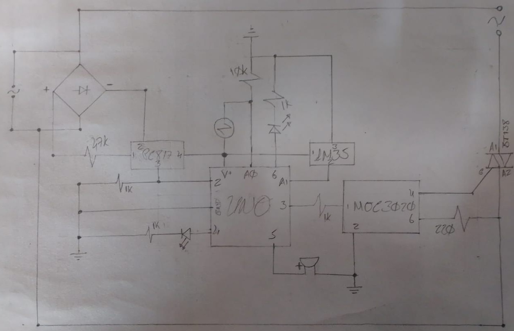

# HomeFarm

_HomeFarm Project build with React.js, SpringBoot, MariaDB and Arduino; Orchestrated with Docker_




## Starting

_Open one terminal and execute:_

```
xhost + & docker-compose up -d
```
Alternatively, run the following command if you want to run the STS4 IDE. Note that the STS4 application directory must be in ${JAVA ENVIRONMENT}/IDE_DIR_HOST on the host machine.
```
docker exec -it -d homefarm_be sh -c "ide_dir/spring-tool-suite-4-4.17.2.RELEASE-e4.26.0-linux.gtk.x86_64/sts-4.17.2.RELEASE/./SpringToolSuite4"
```

In a terminal, execute
```
curl --location --request GET 'http://localhost:8080/thread' | jq
```

This command allows the thread that reads and writes to the Arduino to run.

Then open a web browser and open the homefarm.html file located in the dashboard directory

To finish
```
curl --location --request GET 'http://localhost:8080/stopservice' | jq
```

__________________________
__________________________

## Autor

* **Andrés E. Restrepo F.** - *This project* - [HomeFarm](https://github.com/andres613/HomeFarm.git)
